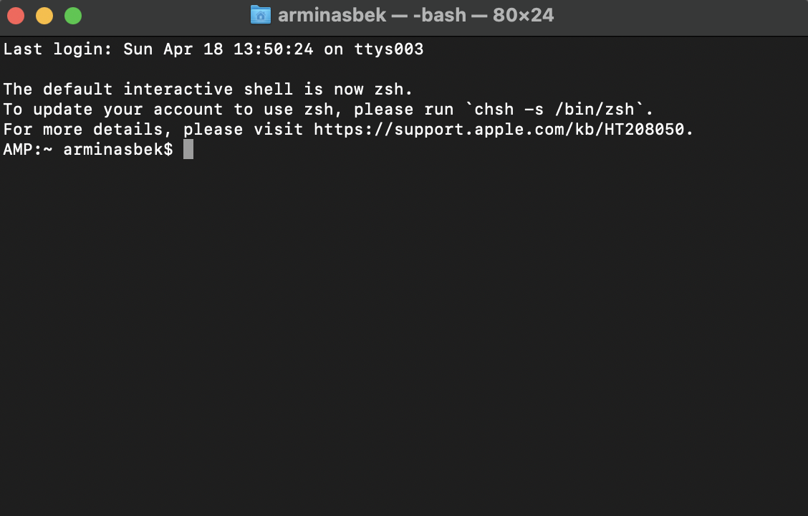
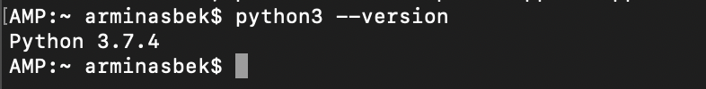
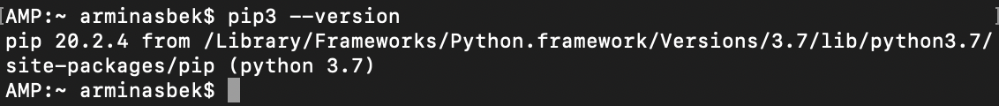
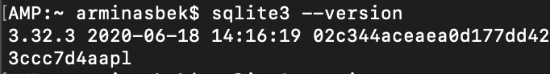
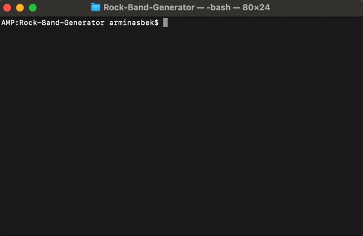

# Rock Band Generator v1.0

## What is it?

This is a command line tool, used to help users generate rock band name and rock band members' names. You can choose from option to generate random band name or choose adjectives and nouns from the database. All band names will be saved for later to choose from and assigned random band members: Vocalist, Bass Guitarist, Drummer and Electric Guitarist.

## Requirements

For this tool to run you will need basic knowledge of command line, Python3, SQLite3, pip3 and Git (optional). SQLite and pip3 should be installed with the newest Python3 version. Please note that this tool was tested on macOS Big Sur 11.2.3 and Ubuntu Server 20.04 LTS, so the following guide should be easy to follow on macOS or Unix-like systems. I, as the developer, currently do not have access to Windows machine to test installation flow or tool itself, however, most, if not all commands should be exactly the same :) 

1. Let's find your terminal, it should be listed in your list of Applications as "Terminal" and once opened should look something like this:

    

2. To find out if you have Python3 installed please enter "python3  --version" to your terminal and press Enter. If you have Python version 3.4 or greater you are good to go. If you do not have Python3 installed or version is less than 3.4 it means that you might need to install pip3 by yourself. For pip3 installation please [click here](https://stackoverflow.com/questions/6587507/how-to-install-pip-with-python-3) and for Python3 installation [click here](https://www.python.org/downloads/).

    

3. To verify if you have pip3 installed, please enter "pip3 version --version" to your terminal and press Enter. If terminal returned pip version similar to example below, please proceed to the next step. 

    

4. To verify if you have SQLite installed, please enter "sqlite3 --version" to your terminal and press Enter. If terminal returned SQLite version, please proceed to the next step. 

    

5. To verify if you have Git installed, please enter "git --version" to your terminal and press Enter. Terminal should return Git version if it is installed. Please note that this step is optional.

    

## Download

### Via command line using Git:

1. Open your terminal
2. Navigate to the location you wish to save this tool using "cd" command (e.g cd Desktop)
3. Enter: git clone [https://github.com/abek101/Rock-Band-Generator.git](https://github.com/abek101/Rock-Band-Generator.git)

### Directly:

1. Go to [https://github.com/abek101/Rock-Band-Generator](https://github.com/abek101/Rock-Band-Generator)
2. Click on green "Code" button
3. Click "Download ZIP" 
4. Save file to your desired location and unzip

## Installation

1. Navigate to the location where Rock Band Generator is downloaded using your terminal. If you downloaded it to your desktop, open new terminal, enter the below and press Enter.

```bash
cd Desktop/Rock-Band-Generator
```

 2.  Enter the below command to install required Python dependencies.

```bash
python3 -m pip install -r requirements.txt
```

## Usage

To run this tool first make sure that you are in Rock Band Generator location and enter the following command to your terminal and press Enter:

```bash
python3 main.py
```

If tool run successfully you should see a menu with options:



To use this tool simply navigate using keyboard arrows to the desired menu option and click Enter. After each band name is generated it will be saved into the database, so you will be able to choose to which band you would like to add your band members.

## To Do:

This is a list of improvements I would do for the later versions of this tool.

- [ ]  Handle error when there is no band names generated, but user want to generate band members
- [ ]  Create an option to assign each band member name to desired role
- [ ]  Create an option to add band member names to the database
- [ ]  Create an option to add adjectives and nouns to the database
- [ ]  Create an option to retrieve fully generated band (band name + band members)

```sql
SELECT bandnames.band_name, vocalist,bass_guitarist, drummer,electric_guitarist FROM bandmembers JOIN bandnames ON bandmembers.band_name_id = bandnames.id
```

- [ ]  Rewrite the code using OOP (Mental note: need to work on my OOP development skills 🙂 )

## Thank You!

